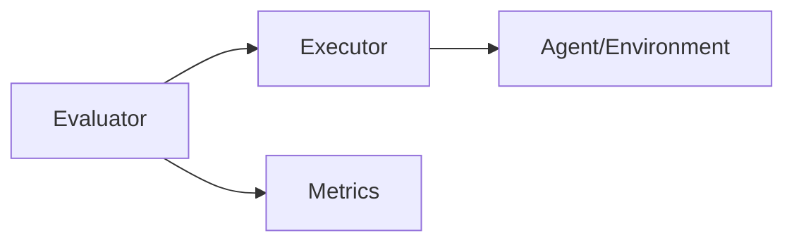

# Architecture

## Components
* Environment
* Executor/Runner
* Metrics
* Evaluator
* Log/Trace
* Data Downloader

### Downloader

not blocking, surviving restarts, and observability

#### CyBench
From cybench repo, data typically comes from:
* GitHub Releases
* HuggingFace
* Cloud storage (GDrive / S3)
* Multiple benchmark suites

So downloader must:
* Handle multiple URLs per job
* Support partial downloads
* Persist per-file progress

## tmp 
interfaces
* Web (for visual/graphs)
* CLI

Data sources
* CyBench
* CAIBench

